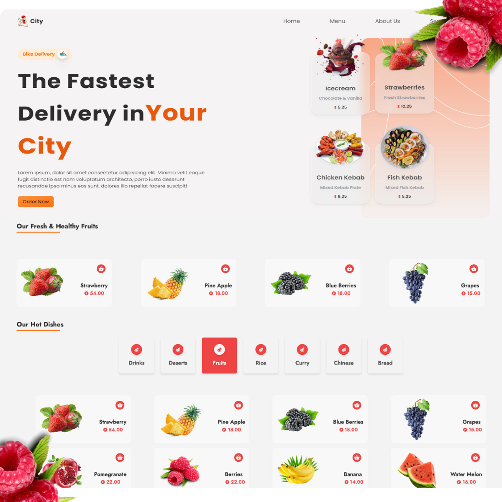

>fullstack food delivery Application React js  
>[follw us]()



# to check the node version

```
 node --version
```

```
yarn create react app folder_name
```

# to start the client

```
yarn start

```

## Other Common Github Profile Sections
👩‍💻 I'm currently working on...

🧠 I'm currently learning...

👯‍♀️ I'm looking to collaborate on...

🤔 I'm looking for help with...

💬 Ask me about...

📫 How to reach me...

😄 Pronouns...

⚡️ Fun fact...